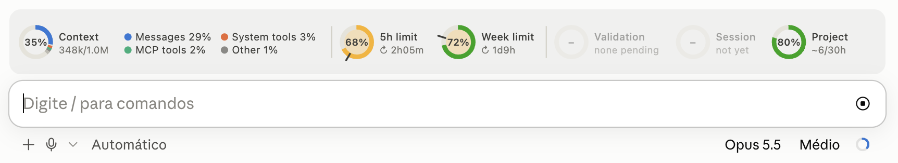
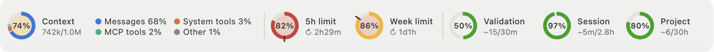
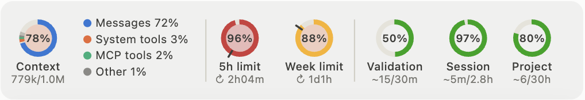
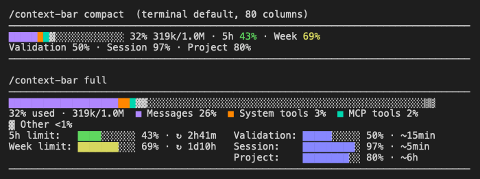
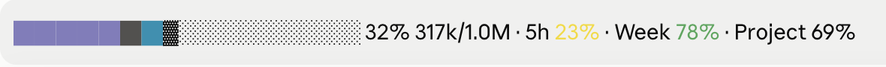
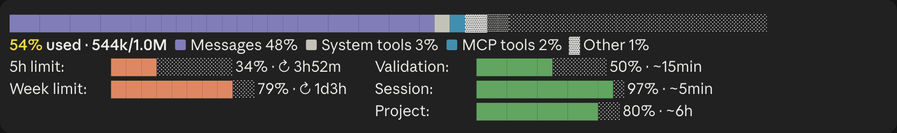

# npk-bar
   [](LICENSE)

A small mod for Claude Code that keeps an eye on the things you would
otherwise have to check by hand: how full the context window is and what is
filling it, how much of your 5-hour and weekly usage limits you have already
spent, and how far along the current work is.

This project was generated by Claude (Claude Opus 5.5 in Claude Code, at medium
effort, with Claude Fable 5.1 as the advisor), under the guidance and
supervision of Victor Domingos. See
[How this was made](#how-this-was-made) for a few more details.

It sits just above the prompt, in the Code tab of the Claude desktop app or in
the terminal, and it refreshes by itself at the end of every turn:



Here is the panel on its own, with every gauge filled in:



Each ring shows one figure: the context window, the 5-hour and weekly limits,
and the progress estimates for the current validation round, the session and
the project. The section [Reading the panel](#reading-the-panel) explains what
every number, colour and mark means.

The mod itself makes no API calls and adds nothing to the model's context. The
optional estimates skill does use a few tokens, as explained in
[What it accesses](#what-it-accesses).

When the window is narrow, the labels move under the rings, and the gauges
wrap onto a second row if needed:



It also follows the app's light or dark theme:


A terminal cannot draw images, so there the same figures are shown as text,
with the colour cues on the bars and numbers instead of the rings. This image
was rendered from the mod's own text layout:




## Installation and dependencies:

All you need is a recent version of Claude Code, either in the terminal or in
the Code tab of the Claude desktop app. Mods are a fairly new feature, so if in
doubt, update it first. There is nothing else to install: no API key, no
packages.

The idea is to clone this repository once on each machine and then link the
mod into your personal skills folder, where Claude Code looks for it. If you
also want the progress estimates, link the
[progress-estimates](skills/progress-estimates/SKILL.md) skill as well.

On macOS and Linux:

```
git clone https://github.com/victordomingos/npk-bar.git ~/dev/npk-bar
mkdir -p ~/.claude/skills
ln -s ~/dev/npk-bar/npk-bar ~/.claude/skills/npk-bar
ln -s ~/dev/npk-bar/skills/progress-estimates ~/.claude/skills/progress-estimates
```

On Windows, in PowerShell (creating a junction does not require administrator
rights):

```
git clone https://github.com/victordomingos/npk-bar.git "$env:USERPROFILE\dev\npk-bar"
New-Item -ItemType Directory -Force "$env:USERPROFILE\.claude\skills"
New-Item -ItemType Junction -Path "$env:USERPROFILE\.claude\skills\npk-bar" -Target "$env:USERPROFILE\dev\npk-bar\npk-bar"
New-Item -ItemType Junction -Path "$env:USERPROFILE\.claude\skills\progress-estimates" -Target "$env:USERPROFILE\dev\npk-bar\skills\progress-estimates"
```

The Windows steps have not been tested yet. If the mod does not load through a
junction on your machine, you can simply copy the two folders instead, but
then you will need to copy them again after each `git pull`.

If you already use some other skill that writes progress estimates, please
skip the `progress-estimates` line. One easy way to tell is that the estimate
gauges already fill in without it. Having both would give Claude two sets of
instructions for the same block.

To check that everything is in place, run:

```
claude plugin validate ~/.claude/skills/npk-bar
```

It should end with `Validation passed`. On Windows, use the path
`"$env:USERPROFILE\.claude\skills\npk-bar"` instead.

To update it later, just run `git pull` in the clone, and any open session
will reload the mod by itself. To uninstall it, delete the links in
`~/.claude/skills` (or `%USERPROFILE%\.claude\skills` on Windows), and the
clone too, if you no longer need it.

Both the mod and the skill are plain TypeScript and Markdown, with no scripts,
binaries or operating system specific code. So far, they have been tested on
macOS.


## How to use

Please note that a Claude Code session that was already open when you
installed the mod will not pick it up. You will need to start a new session,
or restart and resume the current one to keep the conversation (`/exit`
followed by `claude --continue` in the terminal, or quitting and reopening the
desktop app).

Then, turn it on once by typing:

```
/npk-bar
```

The choice is remembered on that machine. Until you pick a layout yourself,
it uses `gauges` in the desktop app and `compact` in the terminal.

**Note:  
The limit figures come from Claude Code itself and only exist on a Pro or Max
subscription. If you use an API key, the limit gauges are not shown. A new or
restarted session starts with the last saved reading (as long as its window
has not reset yet) and updates it after the first reply.**


## Basic usage

Turn the panel on or off:

```
/npk-bar
```

Pick a layout (this also turns it on):

```
/npk-bar gauges
```

```
/npk-bar compact
```

```
/npk-bar full
```

See what the mod sees right now, which is useful when reporting a problem:

```
/npk-bar status
```

Show the version, a short description, the credits and where the idea came from:

```
/npk-bar about
```

These are the three layouts:

| Layout | What it shows |
|---|---|
| `gauges` | The ring gauges shown above (desktop app only; a terminal shows `compact` instead) |
| `compact` | One line (two, when narrow) with a short bar, `% used tokens/window` and the limit and estimate percentages; each limit's percentage takes the worse of its pace and level colours |
| `full` | A full-width bar, the top categories and a short bar for each limit and estimate, side by side when there is room, coloured like the rings |

This is the `compact` layout in the desktop app:



And this is the `full` layout, with the limits and estimates side by side (in
the dark theme):




## Reading the panel

Every ring shows its percentage in the middle, with its name and details next
to it (or under it, on a narrow window). In the desktop app, you can hover a
ring or one of its segments to see the exact figures and comparisons.

**Context.** The arc shows how much of the context window is in use, split by
the three biggest `/context` categories in their own colours, with everything
else merged into a grey *Other*. The legend next to it names each one, and the
line under the name shows the tokens used and the size of the window.

**5h limit and Week limit.** The arc shows how much of each limit has been
used, and the line under the name shows, after the ↻ sign, how long until it
resets. The small tick across the ring marks an even pace, that is, how much
of the window's time has already gone by. The colour of the arc compares the
two:

| Arc | Meaning |
|---|---|
| green | at or under pace (the arc stops at or before the tick) |
| yellow | up to 10 points over pace |
| orange | 10–25 points over |
| red | more than 25 points over, or 90% used whatever the pace |

When Claude Code does not report a reset time, there is no tick, and the arc
turns from green to yellow at 75% and to red at 90%.

**Warning tint (gauges layout).** The inside of the Context and limit rings
turns yellow from 50% used, orange from 75% and red from 90%, and it pulses
from 93% (unless *Reduce motion* is turned on in your system settings). The
text layouts use a single cue for each limit instead of two: the bar (in
`full`) or the percentage (in `compact`) takes whichever is worse of the pace
colour and this level colour.

**Validation, Session, Project.** The arc shows the share of the work already
done, as stated in the estimates block. The line under the name shows the time
left against the implied total, as in `~6/30h` (about 6 hours left, out of
roughly 30 in all) or `~15/38m`. When both figures use the same unit, it is
written only once. The total is not stated anywhere: it is worked out as time
left ÷ (1 − share done), and it is left out below 10% done, where it swings
too much, and at 100%.

The colour of these arcs shows slippage, that is, how much the implied total
has grown since the first estimate for that line:

| Arc | Meaning |
|---|---|
| violet | no earlier estimate to compare with yet |
| green | on the first estimate, under it, or up to 10% over |
| yellow | up to 25% over |
| orange | up to 50% over |
| red | more than 50% over |

The first estimate is the first one in the current session's conversation.
Estimates from different sessions are never compared, because two sessions
may well be estimating different things. When the share done for a line drops
by 30 points or more, which usually means new work has started, its comparison
starts over.

The three estimate slots always stay in the same place. A dim ring with "–"
means there is no estimate for that line yet (Validation only shows up while
you have tests pending). A new session in the same folder carries over only
the Project estimate, since Validation and Session belong to the session that
wrote them. The first screenshot above shows such a session.


## Progress estimates (optional)

The estimate gauges read a short block that Claude writes at the end of its
replies, with one line per item. The labels may also be written in another
language: Portuguese labels are shown in English, and any others are shown as
written.

```
**Validation:** `████████████░░░░░░░░` 60% · ~1h
**Session:**    `████████░░░░░░░░░░░░` 40% · ~3h
**Project:**    `██████████████░░░░░░` 72% · ~45h
```

The context and limit gauges don't need anything else. For the estimates, you
can install the [progress-estimates](skills/progress-estimates/SKILL.md) skill
from this repository (see the installation section above), which tells Claude
when to write the block and how to estimate honestly. Without it, you can
still simply ask Claude for the block.

While the panel is on, the block is hidden from the replies as you see them,
since the panel already shows it. Claude still writes it, because that is
where the panel reads it from, so it stays in the conversation. If you want to
see it inline again, just turn the panel off. After a reload, the mod finds
the latest block in the conversation by itself.


## What it accesses

The mod does not use the network, files or other processes. It only works with
Claude Code's own session data and display. If you want to see every call it
makes, `claude plugin validate ~/.claude/skills/npk-bar` lists them all.

It reads the session's usage figures and, once each time it loads, the
conversation itself, to find the latest estimates block. All of this happens
locally, and nothing is sent anywhere.

It keeps a small local store under `~/.claude/plugins/store/`, with your
on/off and layout choices, the last limit readings and the last estimates for
each project folder (keyed by the folder's path). This file never leaves your
machine.

Its only effect on the conversation is on how it is displayed: while the panel
is on, the estimates block is hidden from the replies as drawn, but it is not
removed.

As for tokens, the mod itself adds nothing to the model's context. The
optional skill adds its one-line listing to every session (about 110 tokens),
its instructions when Claude first uses it (about 800 tokens, plus about 330
during a round of tests), and the block Claude writes (about 100 tokens each
time, which then stays in the conversation).


## Getting help

To see what the mod sees right now (the limits reported, shown and saved, the
estimates, the last refresh and the gauge measurements), use:

```
/npk-bar status
```

A healthy output looks like this:

```
on: true · layout: gauges
context: 39% of 1000000 tokens
rate limits reported now: five_hour 29%, seven_day 79%
limits shown: 5h limit 29%, Week limit 79% · saved: 5h limit 29%, Week limit 79%
estimates: 3 lines · transcript scanned: true
gauges: desktop, 104 columns → 920px allowed, one row needs 790px → labels beside
last refresh: 12s ago
```

If `/npk-bar` is not recognised as a command, either the session was started
before the mod was installed, or the folder ended up nested one level too
deep. In both cases, check the installation and start a new session.

If the command answers but nothing shows up, wait for the next reply, and then
look in the transcript for a dim line starting with `npk-bar:`, which should
name the problem.


## How this was made

This project was inspired by a suggestion in Anthropic's newsletter when mods
for Claude Code were launched, on 3 October 2026, and grew from there.

The code, the documentation and the companion skill in this repository were
written by Claude, under the guidance and supervision of Victor Domingos. The
work was done in Claude Code with Claude Opus 5.5, originally at medium effort,
and Claude Fable 5.1 served as the advisor, reviewing the approach and the
results along the way. Victor decided what the panel should show and how it
should look, tested each version in the desktop app and in the terminal, and
supplied the screenshots used here, while Claude wrote and revised the code and
the text.

## Make it your own

Please feel free to fork this project and turn it into something that suits
the way you work. The panel is a single mod of about 800 lines in two files, so it is a
good place to start if you want to learn how Claude Code mods are made, and
there is plenty of room for variations: different gauges, other figures,
another layout for the terminal, or a completely different take on the same
idea. The code is released under the [MIT License](LICENSE), so you are free
to do so. If you build something nice, or improve something here, I would love
to hear about it, and pull requests are very welcome.

## Did you find a bug or do you have a suggestion?

Please let me know, by opening a new issue or a pull request, and include the
output of `/npk-bar status`.


## Licence and legal notes

npk-bar is released under the [MIT License](LICENSE). In short, you may use,
copy, change and share it, as long as you keep the copyright and licence
notice, and it comes with no warranty of any kind.

The code and documentation in this project were generated by Claude (see
[How this was made](#how-this-was-made)), under human direction. Anthropic's
[Consumer Terms](https://www.anthropic.com/legal/consumer-terms) (section 4)
assign to the user whatever rights Anthropic holds in Claude's outputs, but how
much copyright exists in AI-generated material is still an open question in
many countries. The licence is offered in good faith, to make it clear that
you are welcome to reuse this work.

Some screenshots in this README show parts of the Claude desktop app and of
Claude Code, whose interface belongs to Anthropic and is not covered by this
licence. Claude and Anthropic are trademarks of Anthropic, PBC. This is an
independent project, neither affiliated with nor endorsed by Anthropic.

Nothing in this README is legal advice.
