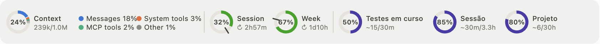
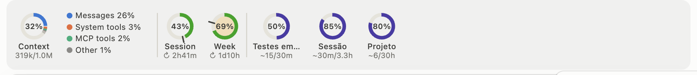
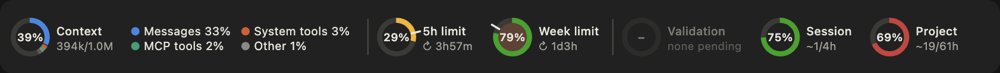
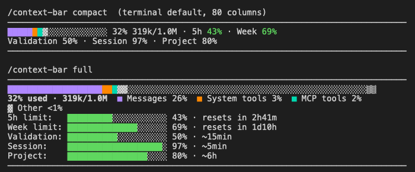
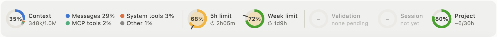

# Context Bar for Claude Code
  

A Claude Code mod that keeps an eye on the things you would otherwise check by
hand: how full the context window is and what is filling it, how much of your
session (5-hour) and weekly limits you have used, and how far along the
current work is.

It draws above the prompt and refreshes by itself at the end of every turn. The
mod makes no API calls and adds nothing to the model's context (the optional
estimates skill adds its listing, and the short block Claude writes per reply).



Context, the 5-hour and weekly limits, and the estimates for validation,
session and project, each as a ring: see [Reading the panel](#reading-the-panel)
for what every number, colour and mark means.

On a narrow window the labels move under the rings and the gauges wrap:



It follows the app's light or dark theme:



In a terminal, which cannot draw images, it shows the same figures as text,
without the colour cues of the rings (rendered from the mod's own text layout):




## Installation and dependencies:

You need a recent Claude Code (mods are a newer feature: update first if in
doubt), in the terminal or in the Code tab of the Claude desktop app. Nothing
else: no API key, no packages to install.

Clone this repository once per machine and link the mod (and, optionally, the
[progress-estimates](skills/progress-estimates/SKILL.md) skill) into your
personal skills folder, where Claude Code loads them from.

On macOS and Linux:

```
git clone https://github.com/victordomingos/claude-mods.git ~/dev/claude-mods
mkdir -p ~/.claude/skills
ln -s ~/dev/claude-mods/context-bar ~/.claude/skills/context-bar
ln -s ~/dev/claude-mods/skills/progress-estimates ~/.claude/skills/progress-estimates
```

On Windows (PowerShell; a junction needs no administrator rights):

```
git clone https://github.com/victordomingos/claude-mods.git "$env:USERPROFILE\dev\claude-mods"
New-Item -ItemType Directory -Force "$env:USERPROFILE\.claude\skills"
New-Item -ItemType Junction -Path "$env:USERPROFILE\.claude\skills\context-bar" -Target "$env:USERPROFILE\dev\claude-mods\context-bar"
New-Item -ItemType Junction -Path "$env:USERPROFILE\.claude\skills\progress-estimates" -Target "$env:USERPROFILE\dev\claude-mods\skills\progress-estimates"
```

If the mod does not load from a junction on your machine, copy the folders
instead of linking them, and copy them again after each `git pull`.

Skip the `progress-estimates` line if you already use another skill that
writes progress estimates: Claude would get two sets of instructions for the
same block.

Check that it is in place:

```
claude plugin validate ~/.claude/skills/context-bar
```

It should end with `Validation passed`. On Windows, use `"$env:USERPROFILE\.claude\skills\context-bar"`.

To update later, `git pull` in the clone: an open session reloads the mod by
itself. To uninstall, delete the links in `~/.claude/skills` (Windows:
`%USERPROFILE%\.claude\skills`); the clone can go too.

The mod and the skill are plain TypeScript and Markdown, with no scripts,
binaries or OS-specific code. Tested on macOS.


## How to use

Start a **new** Claude Code session: one that was already open does not pick
up a newly installed mod. To keep a conversation, restart and resume it
(`/exit`, then `claude --continue`; in the desktop app, quit and reopen it).

Then turn it on once:

```
/context-bar
```

The choice is remembered on that machine. Until you pick a layout, it is
`gauges` in the desktop app and `compact` in a terminal.

**Note:  
The limit figures come from Claude Code itself and only exist on a Pro or Max
subscription; with an API key the limit gauges are not shown. A new or
restarted session shows the last saved reading (if its window has not reset
yet) and updates it after the first reply.**


## Basic usage

Turn the bar on or off:

```
/context-bar
```

Pick a layout (this also turns it on):

```
/context-bar gauges
```

```
/context-bar compact
```

```
/context-bar full
```

See what the mod sees right now, to report a problem:

```
/context-bar status
```

| Layout | What it shows |
|---|---|
| `gauges` | The ring gauges above (desktop app; a terminal shows `compact` instead) |
| `compact` | One line (two when narrow): a short bar, `% used tokens/window`, and the limit and estimate percentages; each limit's percentage is coloured by pace |
| `full` | A full-width bar, the top categories, and a short bar per limit and per estimate (limits and estimates side by side when there is room), coloured like the rings |

The `compact` layout in the desktop app:


## Reading the panel

Every ring shows its percentage in the middle and its name and details beside
it (under it, on a narrow window). On the desktop app, hover a ring or a
segment to see the exact figures and comparisons.

**Context.** The arc is the share of the context window in use, split by the
three biggest `/context` categories in their colours, with everything else
merged as grey *Other*; the legend beside it names them. Below the name:
tokens used / window size.

**5h limit and Week limit.** The arc is how much of the limit is used; below
the name, ↻ and the time until it resets. The tick across the ring marks an
even pace: how much of the window has already gone. The arc's colour compares
the two:

| Arc | Meaning |
|---|---|
| green | at or under pace (the arc stops at or before the tick) |
| yellow | up to 10 points over pace |
| orange | 10–25 points over |
| red | more than 25 points over, or 90% used whatever the pace |

When Claude Code gives no reset time, there is no tick and the arc is green,
then yellow from 75% and red from 90%.

**Warning tint (gauges layout).** The inside of the Context and limit rings
turns yellow from 50% used, orange from 75%, red from 90%, and pulses from
93% (no pulse with *Reduce motion* turned on). The text layouts have no tint.

**Validation, Session, Project.** The arc is the share done, from the
estimates block. Below the name: time left / implied total, e.g. `~6/30h`
(6 hours left of about 30 in all) or `~15/38m`; the unit is written once when
both are the same. The total is derived, not stated: time left ÷ (1 − share
done). It is left out below 10% done, where it swings too much, and at 100%.

The arc's colour is slippage: how much that implied total has grown since the
first estimate of the line.

| Arc | Meaning |
|---|---|
| violet | no earlier estimate to compare with yet |
| green | on the first estimate, under it, or up to 10% over |
| yellow | up to 25% over |
| orange | up to 50% over |
| red | more than 50% over |

The first estimate is the first one in the conversation; Project's is kept
across sessions in the same folder. When a line's share done drops by 30
points or more (new work started), its comparison starts over.

The three estimate slots are always in the same place: a dim ring with "–"
means there is no estimate for that line yet (Validation shows only while you
have tests pending). A new session in a folder carries over only the Project
estimate; Validation and Session belong to the session that wrote them.




## Progress estimates (optional)

The estimate gauges read a short block at the end of Claude's replies, one
line per item. The labels can be in another language: Portuguese ones are
shown in English, others as written.

```
**Validation:** `████████████░░░░░░░░` 60% · ~1h
**Session:**    `████████░░░░░░░░░░░░` 40% · ~3h
**Project:**    `██████████████░░░░░░` 72% · ~45h
```

The context and limit gauges need nothing else. For the estimates, install
the [progress-estimates](skills/progress-estimates/SKILL.md) skill from this
repository (see Installation): it tells Claude when to write the block and how
to estimate honestly. Without it, you can simply ask Claude for the block.

While the bar is on, the block is hidden from the replies as you see them: the
bar already shows it. Claude still writes it (that is where the bar reads it
from), so it stays in the conversation; turn the bar off to see it inline
again. A reloaded session finds the latest block in the conversation by itself.


## What it accesses

- **No network, files or processes.** The mod only uses Claude Code's own
  session data and its display. `claude plugin validate ~/.claude/skills/context-bar`
  lists every call it makes.
- **The conversation, locally.** It reads the session's usage figures, and
  once per load the conversation itself, to find the latest estimates block.
  Nothing is sent anywhere.
- **A small local store** under `~/.claude/plugins/store/`: your on/off and
  layout choice, the last limit readings, and the last estimates and Project
  baseline per project folder (keyed by the folder's path). It never leaves
  your machine.
- **Its effect on the conversation** is display only: while the bar is on, the
  estimates block is hidden from the replies as drawn, not removed.

Cost in tokens: the mod itself adds nothing to the model's context. The
optional skill adds its one-line listing to every session (about 110 tokens),
its instructions when Claude first uses it (about 800 tokens, plus about 330
during a round of tests), and the block Claude writes (about 100 tokens each
time, which then stays in the conversation).


## Getting help

To see what the mod sees right now (limits reported, shown and saved,
estimates, the last refresh and the gauge measurements), use:

```
/context-bar status
```

- **`/context-bar` is not a known command**: the session started before the
  mod was installed, or the folder is nested one level too deep. Start a new
  session.
- **The command answers but nothing shows**: wait for the next reply, then look
  in the transcript for a dim line starting with `context-bar:`, which names
  the problem.


## Did you find a bug or do you have a suggestion?

Please let me know, by opening a new issue or a pull request, and include the
output of `/context-bar status`.
